autoscale: true 
build-lists: true

# [fit]UICollectionView

---

# [fit]What is a UICollectionView?

- A view object that manages an ordered collection of data items and presents them using customizable layouts.

- Data is primarly presented in cells  `UICollectionViewCell`, and optionally supplementary views `UICollectionReusableView`, and decoration view(s).

- The layout object is responsible for defining the organization and location of all cells and supplementary views inside the collection view.

- The collection view uses a **data source object**, which is any object that conforms to the `UICollectionViewDataSource` protocol.

- The layout object is like another data source, only it concerns visual information instead of item data.


---

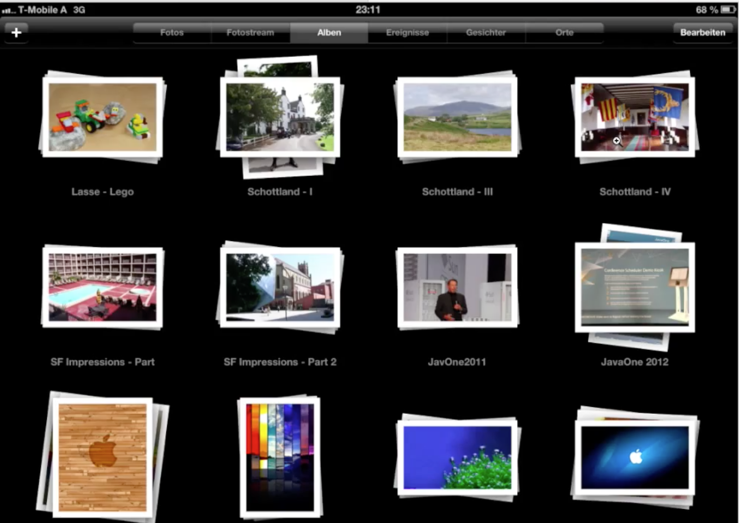

---

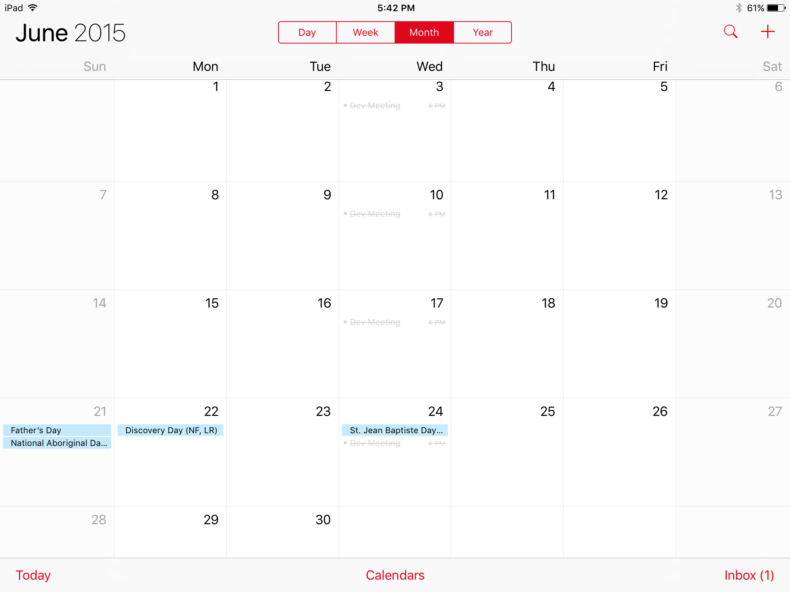

---

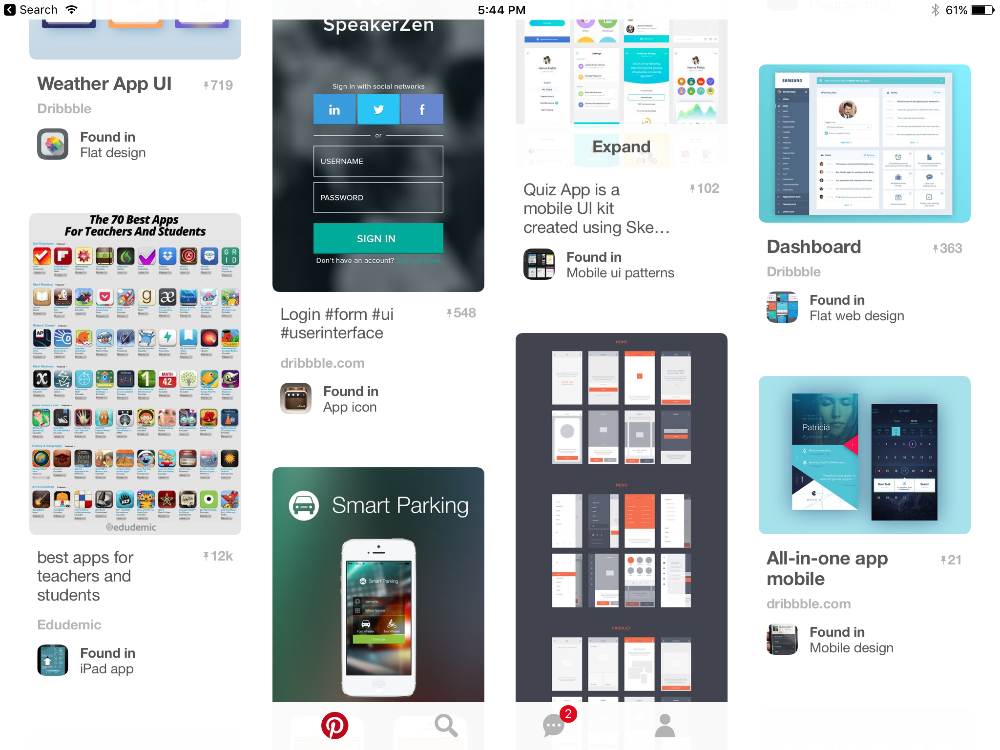

---

## [fit]50,000 Foot View

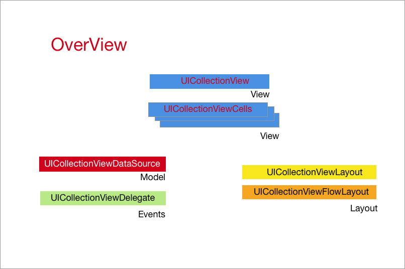

--- 

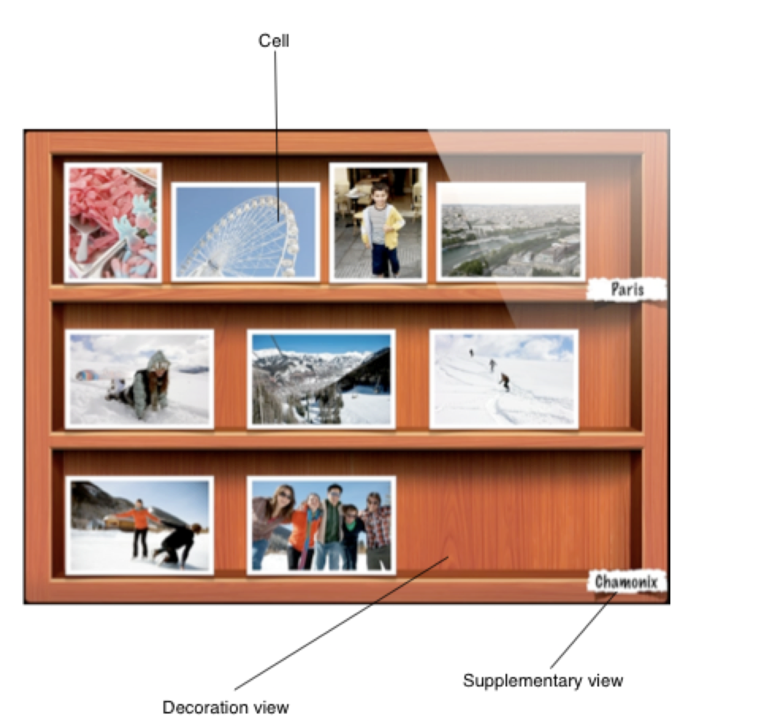

---

## [fit]UICollectionViewCell

* Cells are the content (add content to `contentView`)


---

## [fit] UICollectionReusableView

* `UICollectionReusableView` is an abstract class.
* You subclass it in order to create supplementary views.
* These can be things like headers and footers.
* `UICollectionViewCell` also subclasses `UICollectionReusableView`.

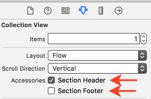

---
## [fit]UICollectionViewDataSource

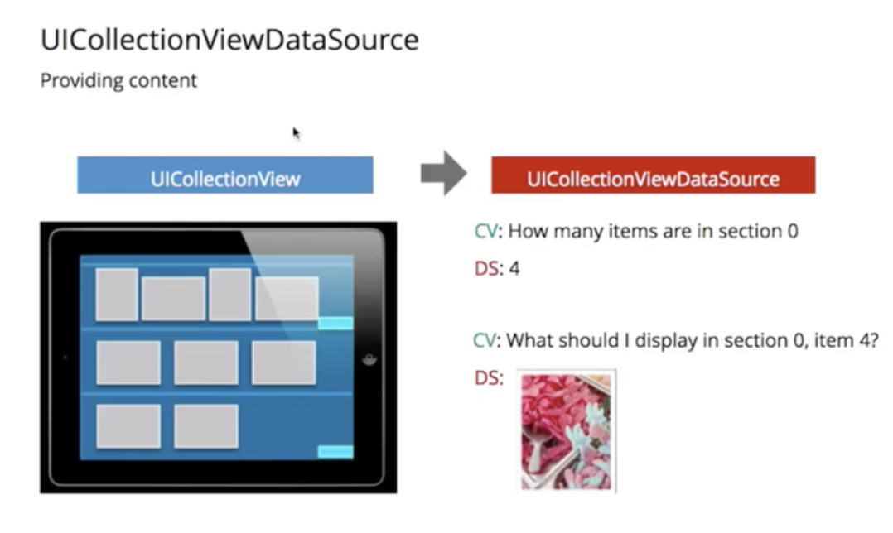

--- 
## [fit]UICollectionViewDataSource Important Methods

```objc

// you should implement this and return the number of sections in your collection

- (NSInteger)numberOfSectionsInCollectionView:(UICollectionView *)collectionView;

// you have to determine the number of items there are for each section and return it here
- (NSInteger)collectionView:(UICollectionView *)collectionView 
     numberOfItemsInSection:(NSInteger)section;

// this is where the model and view intersect
- (UICollectionViewCell *)collectionView:(UICollectionView *)collectionView 
                  cellForItemAtIndexPath:(NSIndexPath *)indexPath;
                  
// if including headers/footers implement this method

- (UICollectionReusableView *)collectionView:(UICollectionView *)collectionView 
           viewForSupplementaryElementOfKind:(NSString *)kind 
                                 atIndexPath:(NSIndexPath *)indexPath;

```

---

##  [fit]UICollectionViewDelegate


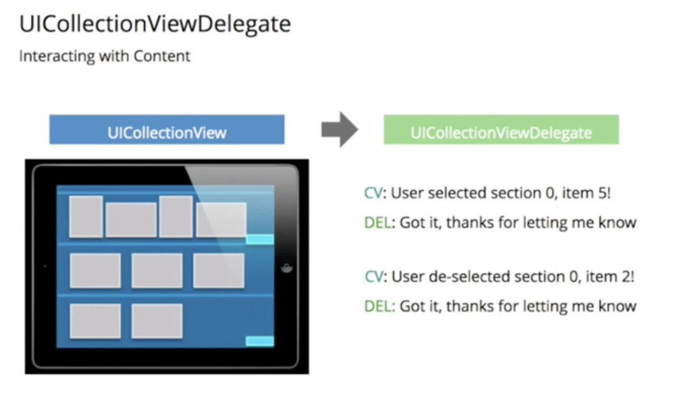

```objc

  - (void)collectionView:(UICollectionView *)collectionView 
didSelectItemAtIndexPath:(NSIndexPath *)indexPath;

```

---
## [fit]UICollectionViewFlowLayout

- Subclass of `UICollectionViewLayout`.

- Used for most grid style layouts.

- By default, a flow layout instance is automatically created and hooked up in IB.

- Access it using the `UICollectionView`'s `collectionViewLayout` property.   (🎗 You will need to cast this).

- What is the difference between a collectionview added as a subview in a UIViewController and a `UICollectionViewController`? (Make sure you understand this)

---

## [fit]UICollectionViewFlowLayout

- You can setup static values for the flowlayout in the storyboard. 

- 🎗 static default flowlayout values automatically set in storyboard may affect your layout & give you results you aren't expecting 🚑.

- Storyboard is a good place to look to see what properties the layout has. Experiment.

- To setup values that are *relative* to the view's dimensions use `viewDidLoad` or `viewWillLayoutSubviews`. (Setting up flow layout dimensions in storyboard does not allow us to make our layout relative to the current screen size).

---

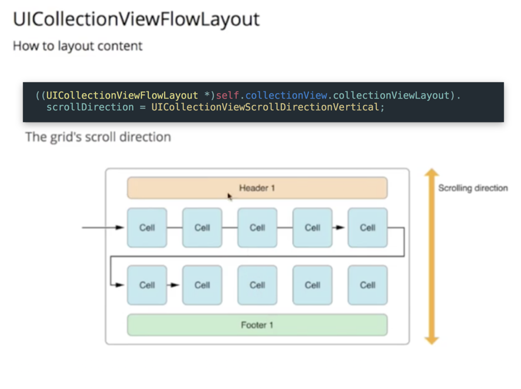

---

```objc


// some property definitions
@property (nonatomic) CGFloat minimumInteritemSpacing;
@property (nonatomic) CGFloat minimumLineSpacing;
@property (nonatomic) UICollectionViewScrollDirection scrollDirection;

// E.g. of casting layout setup in IB to `UICollectionViewFlowLayout`

UICollectionViewFlowLayout* layout = (UICollectionViewFlowLayout*)self.collectionView.collectionViewLayout;
layout.minimumLineSpacing = 10;


```

---

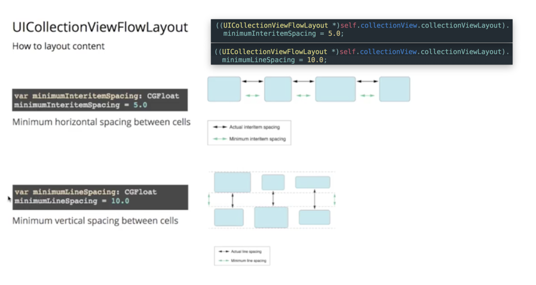

---

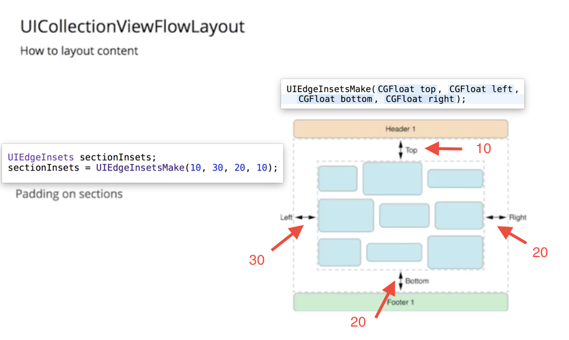

---

## [fit] UICollectionViewDelegateFlowLayout


- You can also setup a delegate to create dynamically sized cells using `UICollectionViewDelegateFlowLayout`.

```objc

- (CGSize)collectionView:(UICollectionView *)collectionView 
                  layout:(UICollectionViewLayout *)collectionViewLayout 
  sizeForItemAtIndexPath:(NSIndexPath *)indexPath;

```

---

## UICollectionViewLayout

- You can customize UICollectionViewFlowLayout by subclassing it.
- You can also create a custom layout class by subclassing `UICollectionViewLayout` and setting your instance to the `collectionViewLayout` property (can be done in IB).
- Layouts can be switched at run time with animations.
- Subclasses of `UICollectionViewLayout` must override the following:

`collectionViewContentSize`

`layoutAttributesForElementsInRect:`

`layoutAttributesForItemAtIndexPath:`

and 

`shouldInvalidateLayoutForBoundsChange:`

---

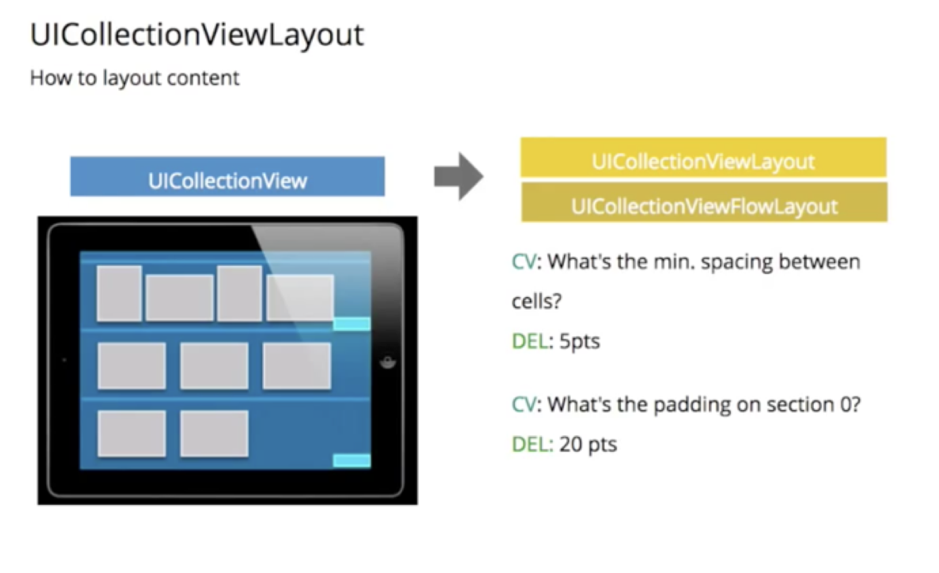

--- 

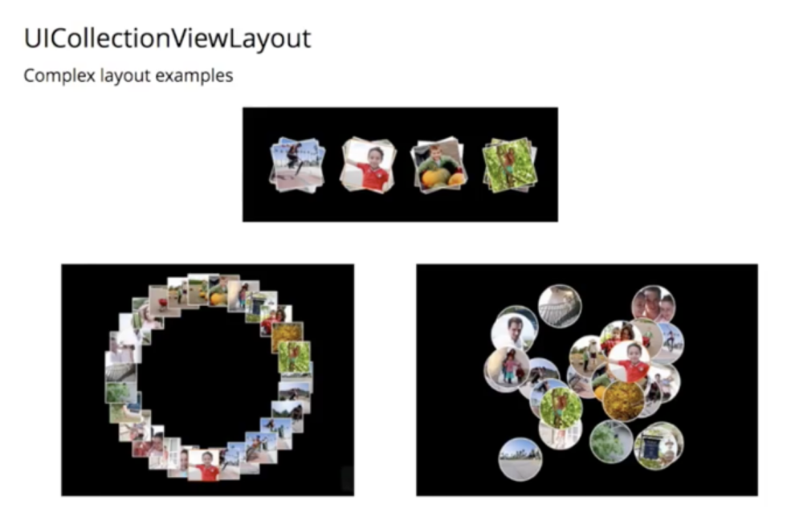


